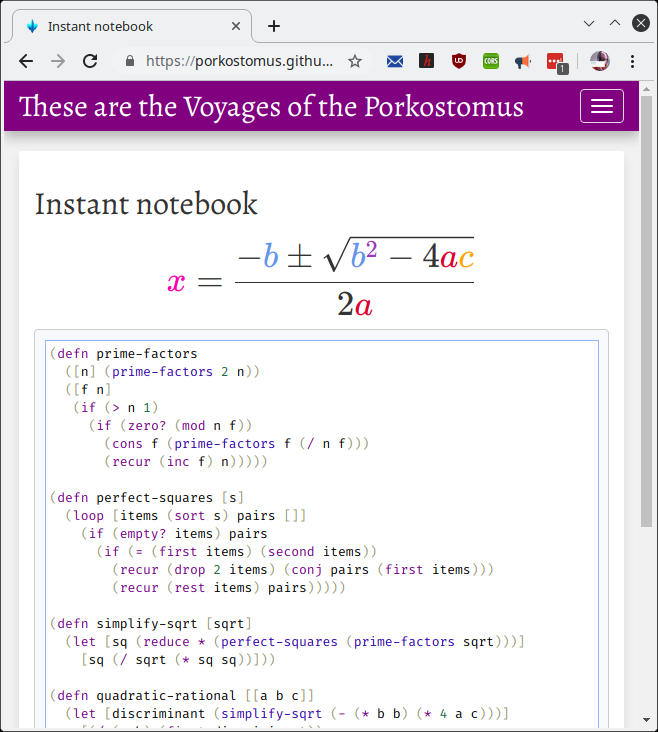
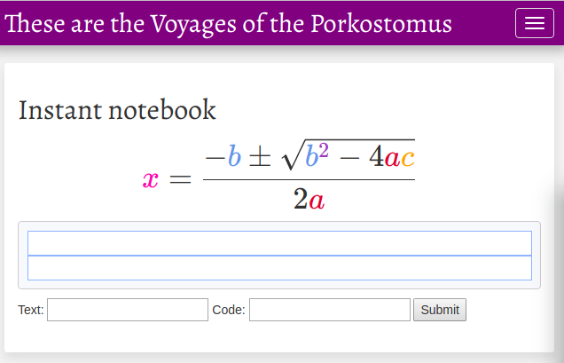

# Instacode

Clojure notebook generator with [KaTeX](https://github.com/KaTeX/KaTeX) and [KLIPSE](https://github.com/viebel/klipse)

## Generate static content from the REPL

The `nb` function takes 2 strings, a text block which may include KaTeX formulas (inline or display style), and an interactive code block. Slashes (`\`), quotes (`"`), etc. must be escaped when used from the REPL. 

The page [here](https://porkostomus.github.io/instacode/) was generated from the REPL like this:

```
~/instacode$ lein repl
instacode.core=> (nb "$$\\huge{\\pink{x}=\\dfrac{-\\blue{b}\\pm\\sqrt{\\blue{b}\\purple{^2}-4\\red{a}\\orange{c}}}{2\\red{a}}}$$" "(defn prime-factors
  ([n] (prime-factors 2 n))
  ([f n]
   (if (&gt; n 1)
     (if (zero? (mod n f))
       (cons f (prime-factors f (/ n f)))
       (recur (inc f) n)))))

(defn perfect-squares [s]
  (loop [items (sort s) pairs []]
    (if (empty? items) pairs
      (if (= (first items) (second items))
        (recur (drop 2 items) (conj pairs (first items)))
        (recur (rest items) pairs)))))

(defn simplify-sqrt [sqrt]
  (let [sq (reduce * (perfect-squares (prime-factors sqrt)))]
    [sq (/ sqrt (* sq sq))]))

(defn quadratic-rational [[a b c]]
  (let [discriminant (simplify-sqrt (- (* b b) (* 4 a c)))]
    [(/ (- b) (first discriminant))
     (last discriminant) (/ (* 2 a) (first discriminant))]))

(quadratic-rational [3 24 48])")
```


## Start a web server

```
~/instacode$ lein run
```


